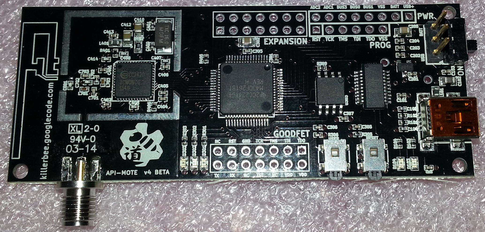

---

## Zigbee Testing Setup with Apimote and Attify

### Hardware Required:

- Apimote Zigbee Sniffer/Analyzer (USB dongle)
<p align="center">
  
</p>


- Attify Zigbee framework (compatible with Apimote dongle)

### Software Installation:

1. **Clone Attify Zigbee Framework:**
   ```shell
   git clone https://github.com/attify/attify-zigbee.git
   cd attify-zigbee
   sudo python setup.py install
   ```

2. **Install Dependencies:**
   ```shell
   sudo apt-get install python-pip
   sudo pip install pyserial cython jsonpickle
   ```

3. **Plug in Apimote Zigbee Sniffer Dongle:**
   Connect the Apimote dongle into an available USB port on your machine.

4. **Assign Permissions:**
   ```shell
   sudo chmod 666 /dev/ttyACM0
   ```

5. **Verify Installation:**
   ```shell
   zigbee-sniffer --channel 11
   ```

   This command initiates scanning on channel 11. Now you can utilize the Attify Zigbee framework to test Zigbee devices, capture traffic, and more.

---

*Note: Ensure you have the necessary permissions and privileges while performing these operations. For any issues or troubleshooting, refer to the official documentation of Attify Zigbee framework and Apimote Zigbee Sniffer/Analyzer.*

---
